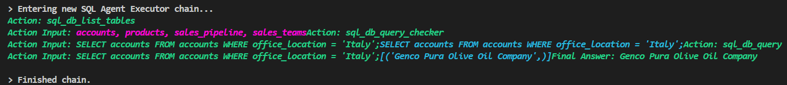

# CRM Database Chatbot

Welcome to the CRM Database Chatbot project!

## Overview

This project features a sophisticated chatbot designed to interact seamlessly with a CRM (Customer Relationship Management) database. The chatbot is capable of understanding and processing natural language queries, converting them into SQL queries, retrieving relevant data from the database, and providing responses in an easy-to-understand natural language format. Additionally, the chatbot supports generating visualizations such as line and bar charts, making it easier for users to gain insights from the data.

## Features

- **Natural Language Queries:** Users can ask questions in plain language about CRM data, such as "What were the sales figures for last quarter?" or "Show me the customer acquisition trends for this year."
- **SQL Query Generation:** The chatbot interprets natural language questions and converts them into SQL queries to interact with the CRM database.
- **Data Visualization:** Users can request visualizations, and the chatbot will generate line and bar charts to represent the data visually.
- **Tabular Data Display:** Users can view data in a tabular format when requested, making it easier to read and analyze.

## Tech Stack

- **LangChain:** Utilized for building and managing language models and their interactions.
- **Google Gemini API:** Provides advanced generative AI capabilities for interpreting and processing natural language queries.
- **Pandas:** Used for data manipulation and analysis, ensuring efficient handling of data.
- **Streamlit:** Facilitates the creation of interactive and user-friendly web applications.
- **Matplotlib & Seaborn:** Employed for generating visualizations and charts to help users understand the data better.
- **SQLAlchemy:** Acts as the ORM (Object Relational Mapper) for interacting with the database, ensuring smooth execution of SQL queries.

## Installation

Follow these steps to set up and run the CRM Database Chatbot on your local machine:

1. **Clone the repository:**

   ```bash
   git clone https://github.com/yourusername/crm-database-chatbot.git
   cd crm-database-chatbot
   ```

2. **Install the required packages:**

   ```bash
   pip install -r requirements.txt
   ```

## Usage

To start the chatbot application, follow these steps:

1. **Run the Streamlit application:**

   ```bash
   streamlit run app.py
   ```

2. **Interact with the chatbot:**
   - **Natural Language Querying:** Ask questions about CRM data in plain English.
   - **Automated SQL Query Generation:** The chatbot interprets the user's query and converts it into an SQL query.
   - **Data Retrieval and Response:** Retrieves the data and provides responses in natural language.
   - **Visualizations:** Request visualizations like line charts and bar graphs based on your request.
   - **Seamless Integration:** Integrate the chatbot into existing CRM systems to enhance user experience.

  


### Example Queries

Here are some example queries you can try with the CRM Database Chatbot:

1. **How many employees are there in Betatech Company?**

   

   Terminal
   

2. **List the companies whose office location is Italy.**

   

   Terminal
   
3. **Show a bar chart of revenue against year_established from the accounts data.**

   

4. **Show a line chart of revenue against year_established from the accounts data.**

   

5. **Display the first 10 sales opportunities and their companies managed by Moses Frase in table format.**

   

   Terminal
   


